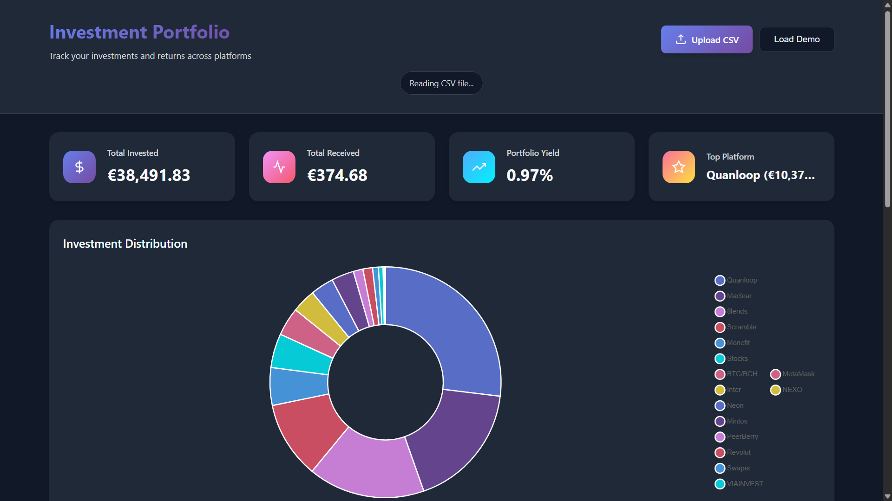

# Investment Portfolio Dashboard

A modern, responsive web dashboard for tracking investments and returns across multiple platforms.



## Features

- 📊 **Interactive Charts**: Visualize your investment distribution with bar charts and donut charts
- 📈 **Historical Tracking**: Track portfolio performance over time with monthly snapshots
- 💰 **KPI Cards**: Track total invested, received, yield, ROI, and profit/loss at a glance
- 🎯 **Goal Tracking**: Set portfolio targets and track progress with visual indicators
- 📉 **Performance Metrics**: View ROI, profit/loss, and yield for each platform
- 📄 **PDF Export**: Generate professional reports with all your portfolio data
- 🔔 **Push Notifications**: Get notified when you reach 25%, 50%, 75%, and 100% of your goals
- 📱 **Home Screen Widget**: See your total portfolio value right on your home screen (Android)
- 📊 **Data Table**: Sortable, searchable table with detailed platform information
- 📱 **Responsive Design**: Works seamlessly on desktop, tablet, and mobile devices
- 🌓 **Dark Mode**: Automatic dark mode support based on system preferences
- 📁 **CSV Import**: Easy data import via CSV file upload (supports multiple files)
- ⚡ **Offline Support**: Works without internet after first load
- 🎨 **Modern UI**: Clean, gradient-based design with smooth animations

## Demo

[View Live Demo](https://github.com/magicothiago-lab/investment-dashboard/)

## 📱 Progressive Web App (PWA)

This dashboard is a full Progressive Web App! You can install it on your phone or desktop for an app-like experience:

### iOS (iPhone/iPad)
1. Open your dashboard URL in Safari
2. Tap the Share button (square with arrow)
3. Scroll down and tap "Add to Home Screen"
4. Tap "Add" in the top right
5. The app icon will appear on your home screen

### Android
1. Open your dashboard URL in Chrome
2. Tap the three dots menu (⋮)
3. Tap "Add to Home Screen" or "Install App"
4. Confirm by tapping "Add" or "Install"
5. The app icon will appear on your home screen

### Desktop (Chrome/Edge)
1. Open your dashboard URL
2. Look for the install icon (➕) in the address bar
3. Click "Install" in the popup
4. The app will open in its own window

### PWA Features
- ✅ Works offline (after first load)
- ✅ Install as standalone app
- ✅ Full-screen experience
- ✅ Fast loading with caching
- ✅ Home screen icon
- ✅ Push notifications for goals
- ✅ Home screen widget (Android)

## New Features Guide

### 📈 Historical Tracking
Track your portfolio performance month-over-month by adding a `Month` column to your CSV:

```csv
Platform,Invested (€),Received,Month
Quanloop,€10.371,17,€131,15,2024-12
Maclear,€6.805,08,€87,14,2024-12
Quanloop,€9.500,00,€115,00,2024-11
Maclear,€6.500,00,€75,00,2024-11
```

The dashboard will automatically:
- Show a line chart with your portfolio growth
- Display month-over-month changes in KPIs
- Calculate historical performance metrics

### 🎯 Goal Tracking
1. Enter your target portfolio value (e.g., €50,000)
2. Set your target date
3. Click "Save Goal"
4. Track your progress with a visual progress bar
5. Get notifications at 25%, 50%, 75%, and 100% milestones!

### 🔔 Push Notifications
1. Click the bell icon (🔔) in the header
2. Allow notifications when prompted
3. Receive alerts when you hit goal milestones
4. Notifications work even when the app is closed!

### 📄 PDF Export
Click "Export PDF" to generate a professional report including:
- Portfolio summary with all KPIs
- Detailed table of all platforms
- Profit/loss breakdown
- ROI calculations
Perfect for sharing with financial advisors or record keeping!

### 📱 Home Screen Widget (Android)
After installing the app:
1. Long-press on your home screen
2. Tap "Widgets"
3. Find "Portfolio" widget
4. Drag to your home screen
5. See your portfolio value at a glance!

The widget shows:
- Total Invested
- Total Received
- Profit/Loss
- ROI percentage
- Last update time

## Getting Started

### Prerequisites

- A modern web browser (Chrome, Firefox, Safari, Edge)
- A CSV file with your investment data

### Installation

1. Clone this repository:
```bash
git clone https://github.com/magicothiago-lab/investment-dashboard.git
cd investment-dashboard
```

2. Open `index.html` in your web browser:
```bash
# On macOS
open index.html

# On Linux
xdg-open index.html

# On Windows
start index.html
```

Or simply drag and drop the `index.html` file into your browser.

### GitHub Pages Deployment

1. Push your code to GitHub
2. Go to your repository settings
3. Navigate to "Pages" in the left sidebar
4. Under "Source", select "main" branch
5. Click "Save"
6. Your dashboard will be available at `https://github.com/magicothiago-lab/investment-dashboard/`

### Setting Up PWA Icons

Before deploying, generate your app icons:

1. Open `generate-icons.html` in your browser (included in the project)
2. Click each download button to get all three icon sizes
3. Place the downloaded PNG files in your project root:
   - `icon-180.png` (for iOS)
   - `icon-192.png` (for Android)
   - `icon-512.png` (for Android high-res)
4. Commit and push these files to GitHub

The icons will automatically be used when users install your app!

## CSV Format

The dashboard expects a CSV file with the following columns:

```csv
Platform,Invested (€),Received,Month
Quanloop,€10.371,17,€131,15,2024-12
Maclear,€6.805,08,€87,14,2024-12
8lends,€6.289,23,€100,69,2024-12
```

### Column Details

- **Platform**: Name of the investment platform (text)
- **Invested (€)**: Amount invested in euros (can use European format: €1.234,56)
- **Received**: Amount received/returned in euros
- **Month** (Optional): Month in YYYY-MM format for historical tracking

### Historical Data Format

To enable historical tracking, include multiple entries for the same platform with different months:

```csv
Platform,Invested (€),Received,Month
Quanloop,€10.371,17,€131,15,2024-12
Quanloop,€9.500,00,€115,00,2024-11
Quanloop,€8.800,00,€95,00,2024-10
```

The app will automatically show trends and calculate month-over-month changes!

### Supported Number Formats

The dashboard supports multiple number formats:
- European format: `€1.234,56` or `1.234,56`
- US format: `$1,234.56` or `1234.56`
- Plain numbers: `1234.56`

## File Structure

```
investment-dashboard/
├── index.html              # Main HTML structure
├── styles.css              # All styling and responsive design
├── app.js                  # JavaScript logic and chart rendering
├── manifest.json           # PWA manifest file
├── sw.js                   # Service Worker for offline support
├── widget-template.json    # Widget display template
├── widget-updater.js       # Widget data updater
├── generate-icons.html     # Icon generator utility
├── icon-180.png           # iOS app icon
├── icon-192.png           # Android app icon
├── icon-512.png           # Android high-res icon
└── README.md              # Documentation
```

## Technologies Used

- **HTML5**: Structure and semantics
- **CSS3**: Modern styling with CSS Grid, Flexbox, and gradients
- **JavaScript (ES6+)**: Data processing and chart rendering
- **Chart.js**: Beautiful, responsive charts
- **DataTables**: Advanced table features (sorting, searching, pagination)
- **PapaParse**: Robust CSV parsing
- **jsPDF**: PDF report generation
- **html2canvas**: Canvas rendering for PDF export
- **Service Workers**: Offline functionality and caching
- **Notifications API**: Push notifications for goals
- **Web App Manifest**: PWA installation and widgets

## Browser Support

- Chrome/Edge (latest)
- Firefox (latest)
- Safari (latest)
- Opera (latest)

## Customization

### Changing Colors

Edit the CSS variables in `styles.css`:

```css
:root {
    --primary-color: #667eea;
    --secondary-color: #764ba2;
    --success-color: #10b981;
    /* ... */
}
```

### Adding New Metrics

1. Add a new KPI card in `index.html`
2. Create calculation logic in `app.js` in the `computeKpis()` function
3. Update the rendering in `renderKpis()`

### Chart Customization

Modify chart options in `app.js` in the `renderCharts()` function. See [Chart.js documentation](https://www.chartjs.org/docs/latest/) for all available options.

## Features Roadmap

- [x] Historical data tracking (monthly comparison)
- [x] Performance metrics (ROI, P&L)
- [x] Goal tracking with progress bars
- [x] Export to PDF
- [x] Push notifications for goals
- [x] Home screen widget
- [ ] Multiple currency support
- [ ] Benchmark comparison (S&P 500, etc.)
- [ ] Category/Asset class grouping
- [ ] Tax calculator
- [ ] Rebalancing suggestions
- [ ] Auto-fetch prices via APIs

## Contributing

Contributions are welcome! Please feel free to submit a Pull Request.

1. Fork the repository
2. Create your feature branch (`git checkout -b feature/AmazingFeature`)
3. Commit your changes (`git commit -m 'Add some AmazingFeature'`)
4. Push to the branch (`git push origin feature/AmazingFeature`)
5. Open a Pull Request

## License

This project is open source and available under the [MIT License](LICENSE).

## Acknowledgments

- Chart.js for the beautiful charts
- DataTables for table functionality
- PapaParse for CSV parsing
- Design inspiration from modern dashboard UIs

## Support

If you encounter any issues or have questions, please [open an issue](https://github.com/magicothiago-lab/investment-dashboard/issues) on GitHub.

---

Made with ❤️ for better investment tracking
